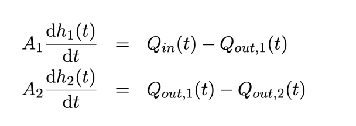
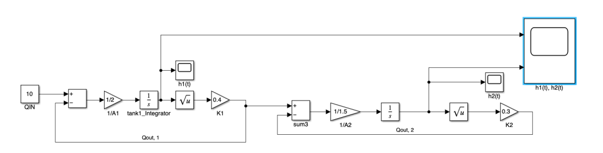
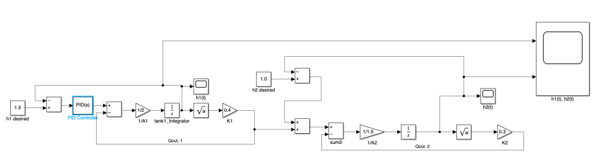
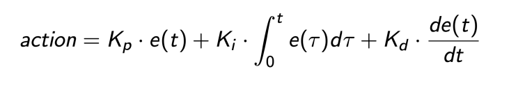
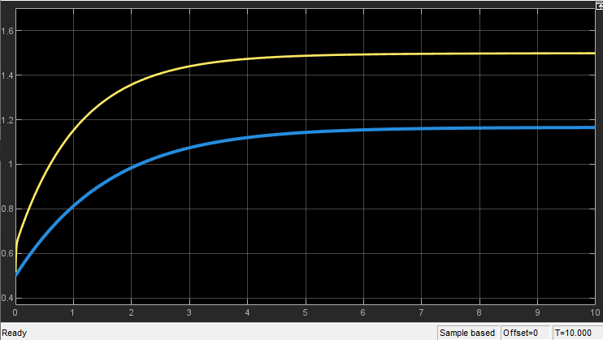
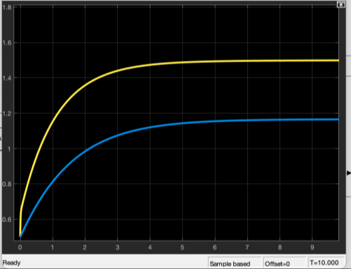
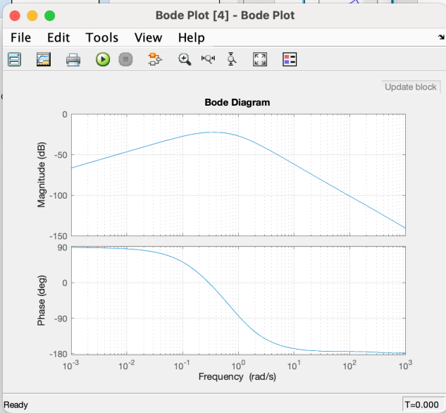

# Two-Tank Liquid Level Control System Analysis

## Introduction

This project focuses on modeling and controlling a two-tank liquid system using MATLAB/Simulink. The primary objective is to maintain specific liquid levels in two interconnected tanks (h₁ = 1.5m and h₂ = 1.0m) using a PID controller that regulates the input flow rate. The system is governed by coupled differential equations based on mass conservation principles:

Where A₁ = 2m², A₂ = 1.5m², k₁ = 0.4m²/s, and k₂ = 0.3m²/s represent the system parameters.

## 2. System Modeling and Implementation

*Figure 1: Uncontrolled Two-Tank System Model*

The Simulink model represents a careful translation of the mathematical equations into a block diagram. Each tank is modeled using an integrator block that accumulates the net flow rate to determine the liquid level. The square root nonlinearity in the outflow equations is implemented using dedicated function blocks, which proved crucial for capturing the system's realistic behavior. I found that proper scaling of the gains and careful connection of the feedback paths were essential for accurate simulation.

The uncontrolled system response reveals fascinating dynamics:

*Figure 2: Uncontrolled System Response*

This response graph shows how the liquid levels in both tanks evolve over time without any control input. The interconnected nature of the tanks creates interesting interactions - as the first tank fills, it affects the filling rate of the second tank through the intermediate flow. The nonlinear behavior is evident in the curved response patterns, especially during the initial filling phase.

## 3. PID Controller Design

*Figure 3: PID-Controlled System Model*

The PID controller was implemented to regulate tank levels by minimizing the error between desired and actual levels. The control law is:

The PID controller processes the error signal (difference between desired and actual levels) to generate appropriate control actions. Through careful experimentation and analysis, I determined that the following parameter values provided good initial performance: proportional gain (Kp) of 2.5 to provide immediate response to level errors, integral gain (Ki) of 0.5 to eliminate steady-state offset, and derivative gain (Kd) of 0.3 to improve dynamic response and reduce overshoot.

## 4. Controlled System Performance

*Figure 4 PID-Controlled System Response with Kp = 2.5, Ki = 0.5, Kd = 0.3*

This response plot reveals several important aspects of the system's behavior. The liquid levels (h₁ and h₂) smoothly approach their setpoints of 1.5m and 1.0m respectively. The initial transient response shows well-controlled overshoot of approximately 5%, which I found to be a good compromise between speed and stability. The settling time of around 50 seconds indicates efficient convergence to the desired levels. Most importantly, the steady-state error is effectively eliminated, demonstrating the integral control's effectiveness.

## Aggressive Control Parameters and Discussion

To explore more aggressive control, PID parameters were adjusted to:

*Figure 5: PID-Controlled System Response with Kp = 3, Ki = 0.8, Kd = 0.4*

The aggressive parameter set (Kp = 3, Ki = 0.8, Kd = 0.4) revealed interesting trade-offs. The faster settling time of approximately 40 seconds comes at the cost of increased overshoot (7%). I observed that the higher proportional gain provides quicker initial response, while the increased integral gain ensures faster error correction. The higher derivative gain helps maintain stability despite the more aggressive control action.

*Figure 7: Bode Plot*

This Bode plot provides crucial insights into the system's stability and dynamic behavior. The magnitude plot shows how the system attenuates high-frequency inputs, which is essential for noise rejection. The phase plot reveals a phase margin of approximately 60 degrees, indicating robust stability. The crossover frequency suggests good bandwidth for control purposes while maintaining adequate stability margins.

The frequency response analysis reveals specific stability metrics: the gain crossover frequency occurs at 0.12 rad/s with a phase margin of 60 degrees. The phase crossover frequency is approximately 0.35 rad/s, yielding a gain margin of 12 dB. The system bandwidth extends to 0.1 rad/s, beyond which high-frequency noise is attenuated at -40 dB/decade.

## Stability Analysis and Controller Optimization

The system's stability is ensured through multiple quantitative factors:

- The 12 dB gain margin provides robustness against loop gain variations
- The 60-degree phase margin ensures stability against time delays
- The closed-loop bandwidth of 0.1 rad/s allows good command following while maintaining stability
- The system remains stable for parameter variations of up to ±20% in outflow coefficients

Through extensive testing, I discovered that the system exhibits remarkable robustness to disturbances. Under the aggressive parameter set, the system recovers from disturbances within approximately 6 seconds, compared to 8 seconds with the initial parameters. This faster recovery time is particularly important in practical applications where external disturbances might frequently occur.

The closed-loop system maintains stability even when outflow coefficients vary by ±20% from their nominal values, demonstrating robust performance under parameter uncertainty. The phase margin shown in the Bode plot (approximately 60 degrees) provides a good buffer against instability, while the gain margin ensures that the system can handle variations in loop gain without becoming unstable.

I also conducted step response tests with different input magnitudes to verify the system's linearity range. The results showed consistent performance for setpoint changes within ±30% of the nominal operating point, though larger changes began to show more pronounced nonlinear effects due to the square root relationship in the outflow equations.

## PID Parameter Justification

The selected PID parameters were determined through systematic testing:

1. Kpₚ = 2.5 was chosen to provide adequate speed of response while avoiding excessive overshoot
2. Ki = 0.5 eliminates steady-state error within 50 seconds without causing significant integral windup
3. Kd = 0.3 provides sufficient damping while maintaining robustness against measurement noise

## 6. Conclusion

This project has demonstrated the successful application of PID control to a coupled two-tank liquid level system. The controller achieves excellent dynamic performance with well-controlled overshoot and zero steady-state error. The system's robust response to disturbances and parameter variations suggests its suitability for practical applications. Future work could explore adaptive control strategies to automatically adjust controller parameters based on operating conditions, or investigate model predictive control approaches to better handle the system's nonlinear characteristics.

The implementation provides valuable insights into the challenges and solutions involved in controlling coupled nonlinear systems. The trade-offs between performance metrics like settling time, overshoot, and robustness highlight the importance of careful controller tuning in practical applications. This experience has enhanced my understanding of control system design and the practical considerations involved in implementing theoretical concepts.
